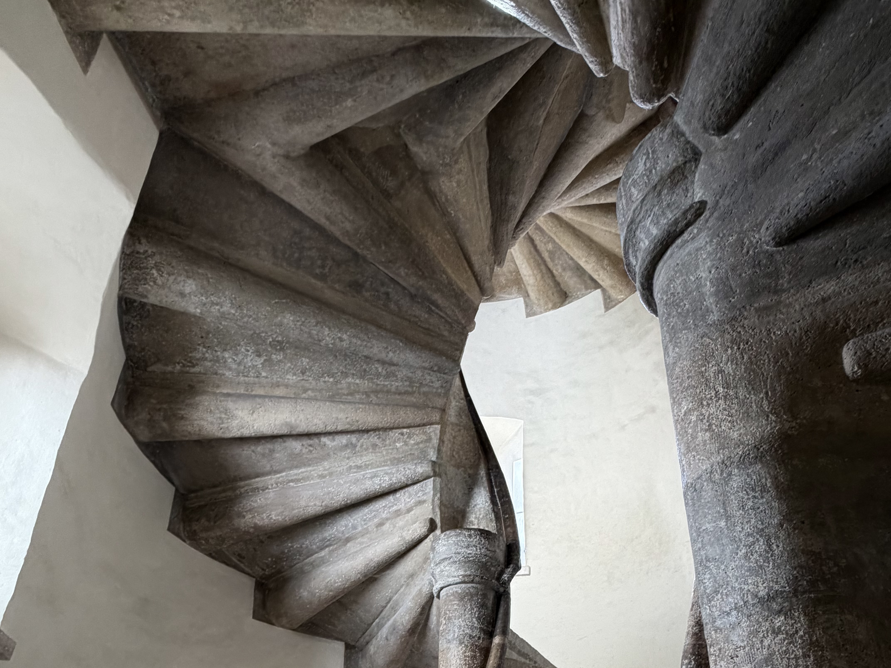
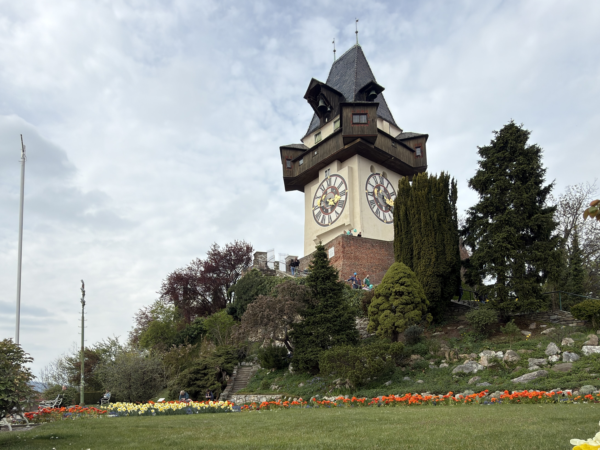
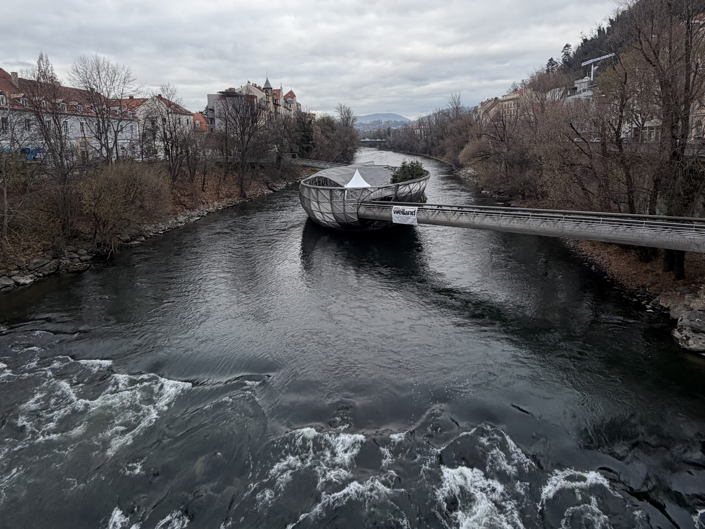

Pokud přemýšlíš, že se zastavíš na skok v Grazu (a opravdu nemáš víc času než jen ten jeden den :-)), tak určitě naštiv alespoň následující 3 místa ve měste:

## Hrad a dvojité točité schodiště

[odkaz na google mapy](https://maps.app.goo.gl/H51rNqpfMRs6FAE17)

Předpokládám, že jsi se došel/došla pěšky. Hned zpočátku musím upozornit, že se v Grazu, hlavně v centru, vyplatí mít oči pořád otevřené a sem tam mrknout i nahoru - celé centrum spadá pod UNESCO díky jeho výborně zachovalému stavu. Je tu plno domů, které jsou stále původní, často i 500 let staré. Tak na to nezapomeň, až půjdeš dál.

Ale teď k hradu. A hlavně k asi hlavní atrakci tady a to dvojitému točitému schodišti. Najdeš ho na druhé straně nádvoří, do kterého se dostaneš z Hofgasse. 

<!---
TODO: Informace o hradu a dvojitem tocitem schodist
"busserl-treppe"
-->

## Uhrturm

[odkaz na google mapy](https://maps.app.goo.gl/cBrhaQd8Ak23YzRm9)

Hodinová věž v Grazu je jednoznačně charakteristickým symbolem města. Tyčí se nad historickým centrem na Schlossbergu a nemůžeš ji nenajít. 

<!---
TODO: Informace o Uhrturmu
-->

## Murinsel

[odkaz na google mapy](https://maps.app.goo.gl/6CMk1Faso8FyqPAL8)

Murinsel, nebo také ostrov na řece Mur. 

<!---
TODO: Informace o Murinsel
2003 Kulturhauptstadt 
-->